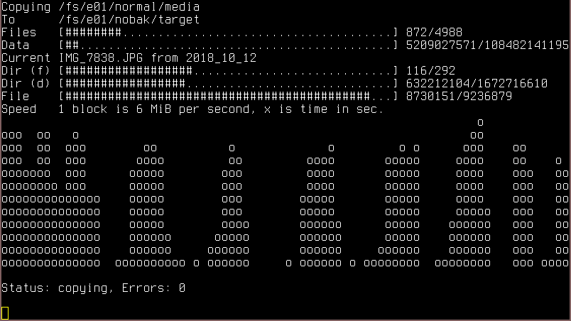

Overview
========

Package `mdvl-java-nostalgic-tools` provides a few Ma_Sys.ma Tools that are
included in MDVL for _nostalgia_ only, because their functionality is provided
by other, and well-maintaned tools. Still, the tools are very simple and run
on Windows as well as Linux which does not always hold for their better
counterparts.

Compile all tools (requres Ant and a JDK) by running

	$ ant

Package them together (on Debian systems with suitable depnendencies installed)
by running

	$ ant package

The following sections describe the individual tools in man-page style.

cmdcolors
=========

## Name

`cmdcolors` -- Display color capabilities of the console (max 16 colors)

## Synopsis

	cmdcolors

## Description

Outputs a table with certain useful ANSI escape sequence colors. Does not
display all possible combinations but some that are considered most useful.

## See also

[colortest-16b(1)](https://manpages.debian.org/buster/colortest/colortest-16b.1.en.html) -- does the same thing but better in all regards: The output is less
convoluted and it reminds the user of the correct escape sequence syntax.

netread
=======

## Name

`netread` -- Listen to data incoming on sockets and display it in hex.

## Synopsis

	netread [port]

## Description

Listens on the specified port by using a socket. Whenever data comes in, it
prints them out in HEX. Once the connection closes, a new socket is created.

The default port is 5971 unless otherwise specified.

## Example

Open a terminal and run netread:

	$ netread
	NetRead 1.0, Copyright (c) 2012 Ma_Sys.ma.
	For further info send an e-mail to Ma_Sys.ma@web.de.

	Listening on port 5971
	Press enter to terminate application.

	 68  65  6c  6c  6f  20  77  6f  72  6c  64  0a                                  hello.world.

	 6e  65  77  20  77  6f  72  6c  64  0a                                          new.world.

In another terminal, send some messages:

	$ echo hello world | nc 127.0.0.1 597
	$ echo new world | nc 127.0.0.1 5971

## See also

[nc(1)](https://manpages.debian.org/buster/netcat-openbsd/nc.openbsd.1.en.html),
[xxd(1)](https://manpages.debian.org/buster/xxd/xxd.1.en.html)
and the shell together do the same:

	$ while true; do nc -l 5971 | xxd; echo; done
	00000000: 6865 6c6c 6f20 776f 726c 640a            hello world.

	00000000: 6e65 7720 776f 726c 640a                 new world.

version_change
==============

## Name

`version_change` -- Compute checksums of a directory's files to detect changes.

## Synopsis

	version_change display DATABASE DIR
	version_change accept  DATABASE DIR

## Description

This tool recursively computes the SHA-256 checksums of all files found
below directory `DIR` and stores them in a CSV file `DATABASE` when invoked with
`accept`.

When invoked with `display`, it will compute all the checksums and based on
that, output a list of files that were either added, changed or removed.

## Bugs

 * `version_change` not use `java.nio` API for traversal and is thus prone to
   endless loops in the presence of symlinks, mount points etc.
 * After displaying the changes, accepting them takes another complete run
   that needs to compute all the checksums. This is highly inefficient!

## See also

[find(1)](https://manpages.debian.org/buster/findutils/find.1.en.html),
[sort(1)](https://manpages.debian.org/buster/coreutils/sort.1.en.html),
[diff(1)](https://manpages.debian.org/buster/coreutils/sort.1.en.html),
[sha256sum(1)](https://manpages.debian.org/buster/coreutils/sort.1.en.html)

Combine them as follows:

	# accept
	find . -type f -exec sha256sum {} + | sort > state_old.txt
	# display
	find . -type f -exec sha256sum {} + | sort > state_new.txt
	diff state_old.txt state_new.txt
	# accept (without recomputation!)
	mv -f state_new.txt state_old.txt

If `cut` and `paste` are added to swap the columns in the `state_` files, it
behaves even more like `version_chnage` in that it will become possible to
detect the difference between changed and added/deleted files.

visual_copy
===========

## Name

`vcp` -- Copy directory trees while displaying a lot of progress info

## Synopsis

	vcp SRC DST

## Description

Copies directory `SRC` to `DST`. Two modes of invocation are to be
distinguished:

 * If `SRC` ends on a trailing slash (e.g. `/root/`), then its contents are
   put directly below `DST`.
 * If `SRC` does not end on a trailing slash (e.g. `/root`), then a directory
   with the same name as `SRC` is created below `DST` and data is copied
   like with `cp -R SRC DST`.

During Invocation, `vcp` displays a lot of progress information. Some of the
ideas (speed diagram) have been taken up by Windows 10's copy function while
others (progress bars separate for number of files and data) are quite
uncommon.

Visual Copy does not retain any file attributes nor modification times.

## Exit Status

--  ----------------------------------------------------------------
1   failed to list some directories or incorrect commandline options
2   failed to copy some files
64  Bug
--  ----------------------------------------------------------------

## See also

[rsync(1)](https://manpages.debian.org/buster/rsync/rsync.1.en.html) --
does everything better except for the progress bars.

	# Command to replace
	vcp /root/ /tmp/test

	# Very reliable, works efficiently over netcat to transfer large
	# structures. No resumption upon interruption.
	tar -C /root -c . | pv | tar -C /tmp/test -x

	# Slightly slower (?) than tar, but allows resuming the transfer
	# and displays the names of the files as transferred
	rsync -av /root/ /tmp/test/

xmlparser
=========

## Name

`xmlparser` -- Commandline tool to parse XML files with Java

## Synopsis

	xmlparser FILE

## Description

This program attempts to parse the given XML file using a `SAXParser` that is
validating and XInclude aware. In case of invalid files, the exception is
printed to console, otherwise no output is shown.

## See also

[xmlstarlet(1)](https://manpages.debian.org/buster/xmlstarlet/xmlstarlet.1.en.html)
which can provide a similar use with `xmlstarlet validate`.
